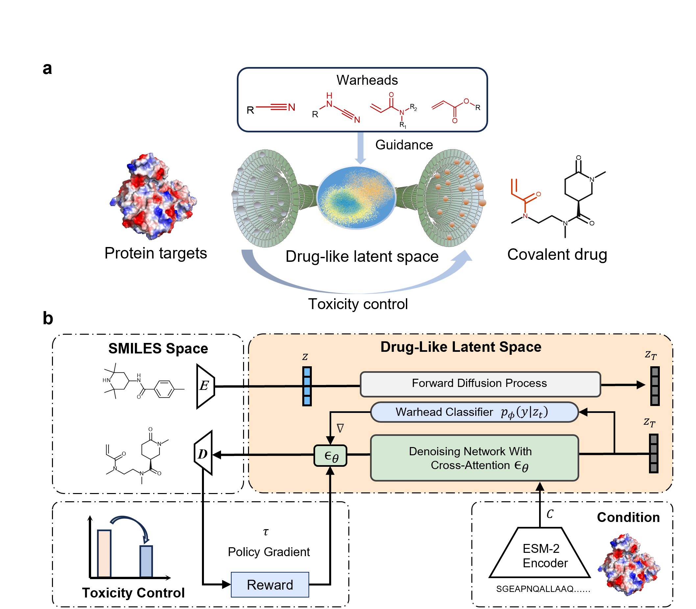

# CovaGen: De Novo Covalent Drug Generation


This repository provides the implementation for the paper:  
**"A Deep Generative Approach to _de novo_ Covalent Drug Design with Enhanced Drug-likeness and Safety"**.




## 🧩 Repository Structure
This repository contains two main modules:  

- **CovaGen-uncond / CovaGen-cond**  
- **CovaGen-guide / CovaGen-rl**

📘 **Detailed Documentation**  
For detailed usage instructions, please also refer to:  
- [README for CovaGen-uncond and CovaGen-cond](./CovaGen_uncond_cond/README.md)  
- [README for CovaGen-rl and CovaGen-guide](./CovaGen_rl_guide/README.md)  

## ⚙️ Installation

```bash
pip install -r requirements.txt
```

## 📂 Dataset
#### CrossDocked Dataset (Index by [3D-Generative-SBDD](https://github.com/luost26/3D-Generative-SBDD))

Download from the compressed package we provide <https://figshare.com/articles/dataset/crossdocked_pocket10_with_protein_tar_gz/25878871>.
```bash
tar xzf crossdocked_pocket10_with_protein.tar.gz
```
The following files are required to exist:
- `$sbdd_dir/split_by_name.pt`
- `$sbdd_dir/index.pkl`

## 💡 Trained Models

Trained models can be downloaded from here:
https://figshare.com/projects/DiffCDD/232655

After download, move the files in each folder to their corresponding Models folder.


## 🔎 Sampling
### CovaGen-uncond  (Unconditional Generation)
Step 1: Generate latent vectors (e.g. 5000 vectors)
```
python scripts/pl_sample_t_uncond  --model_path ./Models/uncond_model004200.pt --save_path wherever/you/like.pkl --diffusion_steps 200 --noise_schedule linear --rescale_timesteps False
```

Step 2: Decode latent vectors into molecules
```
python scripts/decode_save_single.py --sampled_vec saved/path/ --save_path_10k path/to/valid/SMILES --save_path_full path/to/all/SMILES --vae_path ./Models/080_NOCHANGE_evenhigherkl.ckpt
```

### CovaGen-cond (Target-Specific Generation)
#### Single Protein Sampling
```
python scripts/pl_sample_singleseq.py  --model_path ../Models/model009000.pt  --save_path path/to/a/pklfile --num_samples amount/to/sample\\
       --protein_seq "Sequenc you want to sample with"  --diffusion_steps 300 --noise_schedule linear --rescale_timesteps False \\
```


```
python scripts/decode_save_single.py --sampled_vec saved/path/ --save_path_10k path/to/valid/SMILES --save_path_full path/to/all/SMILES --vae_path ./Models/080_NOCHANGE_evenhigherkl.ckpt
```

#### Batch Sampling (Crossdocked2020 Testset)
```
python scripts/pl_sample_full.py --model_path ./Models/cond_model009000.pt --save_path path/to/a/directory! --diffusion_steps 300 --noise_schedule linear --rescale_timesteps False 
```

```
python scripts/decode_save.py --sampled_vec path/of/latent vectors --save_path_10k path/for/100valid/molecules/for/each/pocket --save_path_full path/for/all/decoded/molecules --vae_path ./Models/080_NOCHANGE_evenhigherkl.ckpt
```
### CovaGEN-guide and CovaGEN-rl
#### Single protein sampling
For CovaGen-guide, use the model before RL fine-tuning, and specify the classifier scale s, and the classifier model path. 2 Classifiers are provided in ./Models/.
```
python scripts/rl_sample_guided_singleseq.py   --classifier_scale scale/s --protein_seq "sequence" --classifier_path path/to/classifier --model_path path/to/trained/model \\
    --save_path path/for/saving/SMILES/generated/pkl
    --class_cond False --rescale_timesteps False --diffusion_steps 300 --noise_schedule linear
```

For CovaGen-rl, use the fine-tuned model, set classifier_scale to 0.
```
python scripts/rl_sample_guided_singleseq.py   --classifier_scale 0 --protein_seq "sequence" --classifier_path path/to/classifier --model_path path/to/rl/model
    --save_path path/for/saving/SMILES/generated/pkl
    --class_cond False --rescale_timesteps False --diffusion_steps 300 --noise_schedule linear
```
And to sample with CovaGen, use the fine-tuned model and specify the classifier scale s.
Note that you need to stop these scripts manually to finish the sampling procedure, which saves generated molecules while running.

#### Batch Sampling (Crossdocked2020 Testset)
Use scripts/rl_train_sample_guided.py instead, with same parameters except don't specify the protein sequence.
The processed Crossdocked2020 test set should be downloaded and moved to the Models folder here.

Note that you need to stop these scripts manually to finish the sampling procedure, where generated molecules are saved while running.

## 🏋️ Train
>The trained models are provided in the repository at 'CovaGen/CovaGen_uncond_cond/Models' and 'CovaGen/CovaGen_rl_guide/Models'.
To train unconditional latent diffusion model, go to the training folder, make sure you have all the dataset and models downloaded and put in the Models folder, then run
```
python pl_train_uncond_zinc_t.py --logging_path model/saving/path --dataset_save_path uncond/dataset/path --vae_dir path/to/vae
                                 --diffusion_steps 200 --noise_schedule linear 
                                 --schedule_sampler loss-second-moment --batch_size 65536 --lr 1e-3 --rescale_timesteps False
```
And to train a conditional latent diffusion model
```
python pl_train_full.py --log_dir model/save/path --vae_dir vae/path --data_dir crossdocked/dataset/path
                        --dataset_save_path processed/crossdocked/path
                        --diffusion_steps 300 --noise_schedule linear --schedule_sampler uniform --batch_size 128
```
To fine-tune the model on your scoring function, please go to the training folder. Run this to start training, trained models are saved in the log dir.
```
python rl_train.py   --classifier_path path/to/classifier --model_path path/to/diffusion/model --vae_dir path/of/trained/vae 
    --log_dir path/for/saving/finetuned/pkl --data_dir path/of/crossdocked/dataset
    --class_cond False --rescale_timesteps False --diffusion_steps 300 --noise_schedule linear --classifier_scale 0 
```


